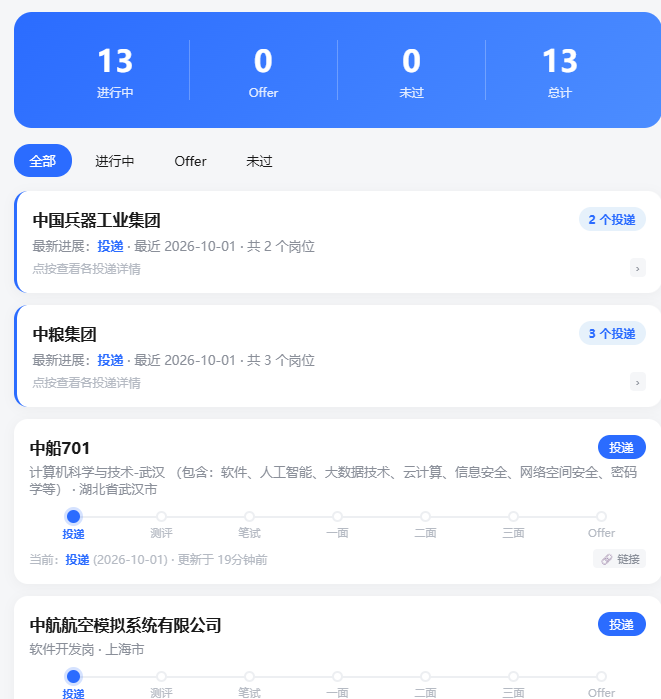
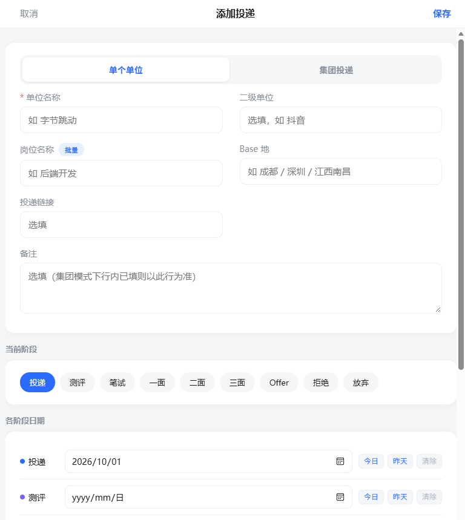

# 多投 · 秋招投递记录

> 秋招投了几十家公司，Excel 表越记越乱、记在哪台设备上就只能在哪台设备看？
> **多投**是一个专为秋招 / 求职季打造的投递进度记录工具：打开网页就能记，手机电脑同步看，一个流水线视图看清每一家公司走到哪一步了。

   

<p align="center">
  
  &nbsp;&nbsp;
  
</p>

## ✨ 为什么用多投

- **一眼看清全局**：顶部实时统计「进行中 / Offer / 未过 / 总计」，按状态筛选，心里有数。
- **流水线式进度**：每条投递是一根「投递 → 测评 → 笔试 → 一面 → 二面 → 三面 → Offer」的进度条，点一下方块就能前进 / 后退，还能记录每个阶段的日期。
- **集团投递一次搞定**：投中信银行总行 + 天津分行 + 北京分行？用「集团投递」模式，一次填多条，集团名下自动聚合；每条投递的 **Base 地、投递日期、备注** 各自独立，链接共用。
- **智能阶段推导**：改个日期，阶段自动跟着变——哪天记了一面日期，状态自动推进到「一面」，不用手动维护。
- **手机当 App 用**：支持 PWA，手机浏览器「添加到主屏幕」后就是独立 App，免登录常驻。
- **数据归属清晰**：基于 Supabase Auth + 行级安全（RLS），每个账号只能看到自己的数据，注册即用。
- **免费白嫖**：纯静态前端 + Supabase Free Plan，个人使用零成本，GitHub Pages 免费托管。

## 🚀 快速开始（部署你自己的多投）

整个过程约 10 分钟，无需任何后端开发。

### 1. 创建 Supabase 项目

1. 打开 [supabase.com](https://supabase.com/dashboard)，注册并 **New project**。
2. 进入 **SQL Editor**，把本仓库的 [`schema.sql`](schema.sql) 整段粘贴执行——建表 + 行级安全策略一步到位。
3. 到 **Project Settings → API** 复制两个值：
   - `Project URL`
   - `anon public key`（这是公开设计的 key，数据安全由 RLS 策略保证）

### 2. 配置并部署

1. Fork / 克隆本仓库。
2. 编辑 [`config.js`](config.js)，把两个值填进去：

   ```js
   const SUPABASE_URL = 'https://xxxx.supabase.co';
   const SUPABASE_ANON_KEY = '你的 anon key';
   ```

3. 推到任意静态托管即可，最简单的是 GitHub Pages：
   - 仓库 **Settings → Pages → Source** 选 `main` 分支根目录；
   - 访问 `https://<你的用户名>.github.io/<仓库名>/` 即可使用。

### 3. 手机安装为 App（可选）

手机浏览器打开站点 → 菜单里选 **添加到主屏幕**，之后从桌面图标进入即为独立 App 窗口，登录态持久保持。

## 📖 使用说明

### 记录一条投递

点击右下角 **＋**，两种模式任选：

| 模式 | 适合场景 | 填写内容 |
| --- | --- | --- |
| **单个单位** | 普通公司投递 | 单位名称、二级单位、岗位（支持批量添加多岗位）、Base 地、链接、备注、日期 |
| **集团投递** | 同一集团多单位/多分行 | 集团名称 + 多条投递行，每行独立填：具体单位、岗位、Base 地、投递日期、备注；链接共用 |

### 推进 / 回退进度

- 列表中点击任意投递卡片，进入详情弹层；
- 点击进度条上的阶段方块，即可直接切换状态（**可进可退**）；
- 或在详情里直接填写各阶段日期，阶段会按「最晚已填日期」自动推导。

### 管理集团投递

- 同一 `group_name` 的多条投递在首页自动聚合为一张集团卡片；
- 卡片显示「进行中岗位的最晚活动时间」，全部结束后回退为全组最晚时间；
- 点进集团卡片可查看每条投递详情，或「在此集团下新增」继续追加岗位。

### 导出数据

账户页提供 **CSV 导出**，数据始终是你的。

## 🧱 技术栈

| 层 | 实现 |
| --- | --- |
| 前端 | 原生 HTML / CSS / JavaScript，无框架、无构建，单页应用约 1600 行 |
| 后端 | Supabase（Postgres + Auth + Row Level Security） |
| 部署 | GitHub Pages 静态托管，PWA 可安装 |
| 数据 | 单表 `applications`，`stage_dates` 用 JSONB 存各阶段日期，`group_name` 做显示层聚合 |

## 📁 目录结构

```
duotou-web/
├── index.html          # 单页入口
├── app.js              # 全部业务逻辑（状态、渲染、Supabase 交互）
├── style.css           # 样式（移动优先，720px 断点适配桌面两列）
├── config.js           # Supabase 配置（改成你自己的）
├── schema.sql          # 一键建表 + RLS 策略
├── manifest.webmanifest / icon.svg   # PWA 清单与图标
└── docs/               # 截图
```

## 🗺️ 规划中

- [ ] 阶段时间线统计（平均流转时长、卡点分析）
- [ ] 面试提醒（阶段日期临近通知）
- [ ] 投递链接自动抓取公司 / 岗位信息

## 🤝 贡献

欢迎 Issue / PR！改前端直接编辑对应文件即可，无构建步骤。

## 📄 License

MIT
