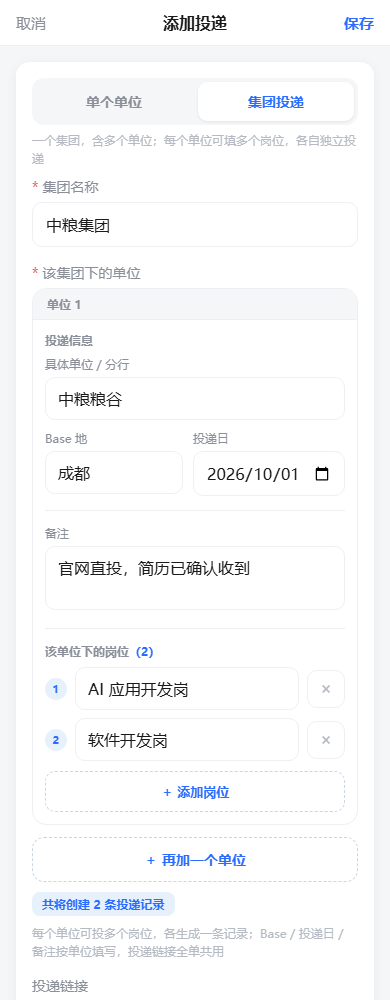

# 多投 · 秋招投递记录

> 秋招投了几十家公司，Excel 表越记越乱、记在哪台设备上就只能在哪台设备看？
> **多投**是一个专为秋招 / 求职季打造的投递进度记录工具：打开网页就能记，手机电脑同步看，一个流水线视图看清每一家公司走到哪一步了。

   

<p align="center">
  
  &nbsp;&nbsp;
  
</p>
<p align="center">
  
</p>

## ✨ 为什么用多投

- **一眼看清全局**：顶部实时统计「已投递 / 一面 / 二面 / Offer」各阶段数量，按状态筛选，心里有数。
- **流水线式进度**：每条投递是一根「投递 → 测评 → 笔试 → 一面 → 二面 → 三面 → Offer」的进度条，点一下方块就能前进 / 后退，还能记录每个阶段的日期。
- **同一单位多个岗位**：一个单位下想投「AI 应用开发岗」和「软件开发岗」？在岗位列表里点「＋ 添加岗位」逐条加即可（也可以把多个岗位名一次粘贴进来），**每个岗位都有各自的 Base 地与备注**（同一个单位投总部岗和外地岗也不用建两条），保存时按岗位各自生成一条记录独立推进。首页会自动把同一单位的多个岗位聚合成一张单位卡，一眼看出「这家我投了几个岗、各自到哪了」。
- **集团投递一次搞定 / 也能随手归并**：投中信银行总行 + 天津分行 + 北京分行？用「集团投递」模式一次填多条；平时投单个单位时，也可以只填一个「集团名称（选填）」，之后同集团的投递会自动聚合成集团卡片。每张单位卡可填**默认 Base 地与备注**（该单位下岗位未填时沿用），岗位行里还能单独覆盖；投递日期按单位、链接全单共用。
- **智能阶段推导**：改个日期，阶段自动跟着变——哪天记了一面日期，状态自动推进到「一面」，不用手动维护。
- **找得到**：搜索页只有一个搜索框，一个关键词同时搜**岗位名称 / 单位名称（公司、子公司、集团）/ Base 地 / 岗位描述**，结果按「岗位命中 > 单位命中 > Base 命中 > 描述命中」排序，卡片上标出这条靠哪个字段命中；配合「阶段」快捷标签与「最近更新 / 投递日期 / 阶段进度」排序使用。
- **手机当 App 用**：支持 PWA，手机浏览器「添加到主屏幕」后就是独立 App，免登录常驻。
- **数据归属清晰**：基于 Supabase Auth + 行级安全（RLS），每个账号只能看到自己的数据，注册即用。
- **免费白嫖**：纯静态前端 + Supabase Free Plan，个人使用零成本，GitHub Pages 免费托管。

## 🚀 快速开始（部署你自己的多投）

整个过程约 10 分钟，无需任何后端开发。

### 1. 创建 Supabase 项目

1. 打开 [supabase.com](https://supabase.com/dashboard)，注册并 **New project**。
2. 进入 **SQL Editor**，把本仓库的 [`schema.sql`](schema.sql) 整段粘贴执行——建表 + 行级安全策略一步到位（含岗位附件所需的存储桶与 `remark_images` 列；这段是幂等的，重复执行安全）。
3. 到 **Project Settings → API** 复制两个值：
   - `Project URL`
   - `anon public key`（这是公开设计的 key，数据安全由 RLS 策略保证）

### 2. 配置并部署

1. Fork / 克隆本仓库。
2. 编辑 [`config.js`](config.js)，把两个值填进去：

   ```js
   const SUPABASE_URL = 'https://xxxx.supabase.co';
   const SUPABASE_ANON_KEY = '你的 anon key';
   ```

3. 推到任意静态托管即可，最简单的是 GitHub Pages：
   - 仓库 **Settings → Pages → Source** 选 `main` 分支根目录；
   - 访问 `https://<你的用户名>.github.io/<仓库名>/` 即可使用。

### 3. 手机安装为 App（可选）

手机浏览器打开站点 → 菜单里选 **添加到主屏幕**，之后从桌面图标进入即为独立 App 窗口，登录态持久保持。

## 📖 使用说明

### 记录一条投递

点击右下角 **＋**，两种模式任选：

投递层级是 **集团 → 单位 → 岗位**，一个单位可以同时投多个岗位，每个岗位生成一条独立记录（各自推进、各自记日期）。

| 模式 | 适合场景 | 填写内容 |
| --- | --- | --- |
| **单个单位** | 普通公司投递 | 第一行并排：**单位名称 + 集团名称（选填，填了自动归并）**；下面是**岗位列表（＋ 添加岗位，可批量粘贴多行；每个岗位各自的 Base 地、岗位描述与岗位附件）**、链接、当前阶段与各阶段日期 |
| **集团投递** | 同一集团多单位/多分行 | 集团名称 + 单位卡列表；每张卡填：具体单位、**默认 Base 地与岗位描述（岗位未填时沿用）**、投递日期，以及**该单位下的岗位列表（每个岗位可单独覆盖 Base 地与岗位描述）**；投递链接全单共用 |

> 单个单位模式只有「单位名称」这一层名字，**不再有「二级单位」输入框**——它只属于集团投递模式（那张单位卡的名字）。历史数据里已有的二级单位照常展示，不会被清空。

> 两种方式都能归并：投单个单位时顺手填一下「集团名称」，之后同集团的投递会在首页自动聚合成一张集团卡片（≥2 条时合并）；集团名有候选提示，选中已有集团会提示将合并到哪个组。

表单里的几点约定：

- 所有可输入框都是白底 + 描边的，聚焦时会亮蓝边，一眼能区分「能打字的地方」和说明文字；
- 必填项没填时字段下方会留一行红字提示，并自动滚到该字段，不依赖一闪而过的提示条；
- 「各阶段日期」默认收起，标题上显示已填几项，展开后逐项填写或点「今日 / 昨天 / 清除」；**每个阶段都能再填一个具体时间**（面试约的几点），时间可选，不填就不显示——先在阶段行右边的下拉里选（整点 / 半点，7:00 到 22:00），也可以直接在详情弹层里手写「下午3点」「晚上8点半」「15:00」这类写法，保存时会统一成 24 小时制；某个阶段还没填日期时，时间位置显示一个置灰的「时间」按钮，点它会提示先填日期。

多岗位的几条约定：单单位最多 10 个岗位、单次最多 20 个单位 / 60 条记录；同一单位内「岗位名 + Base 地」完全相同的重复岗位保存时只留一条，同名不同 Base 会各自保留（如同名岗位在广州、成都各投一次）；岗位可以不填（只投单位不明岗位也会生成 1 条）；表中单位 / 岗位清空则整条跳过。

岗位区右上角的「智能识别」是灰度功能（弱化入口，只占一个文字链）：整段粘贴招聘信息（不用管格式、不用按模板排），自动拆出结构化字段——**单位名称 / 岗位 / Base 地 / 投递链接 / 岗位职责（要点）/ 任职要求（要点）/ 薪资 / 招聘人数 / 联系方式 / 投递截止 / 其他关键信息**，输出为固定字段名的对象，岗位职责与任职要求会被提炼成要点列表。

识别不依赖固定模板：先按**段标题**（`岗位职责` `岗位要求` `工作地点`…，带不带冒号、值和标题是否同行都认）把文本归类，段内再按编号（`1.` `（1）` `①`）和句号切成要点，去掉营销话术与引导句，超长要点按分句截到 120 字。三层递进、命中即停：① 段标题 / 标签行；② 匹配你历史填过的单位名与岗位名（datalist 候选）；③ 启发式（公司后缀、首个不含岗位词与地名的短段、岗位关键词、地名表）。**文本里没提到或认不出的字段一律留空，绝不推测、不编造**。

结果先出可编辑预览：上面几项直接回填表单，任职要求与薪资 / 人数 / 联系方式等列在「其他识别到的信息」里供核对，可用勾选决定是否并进岗位描述（手改过就不再自动覆盖）。确认后才写入表单，且**只填空字段、已有内容不覆盖**。纯前端实现，不调用任何外部服务，也不需要 API Key。

### 推进 / 回退进度

- 列表中点击任意投递卡片，进入详情弹层；
- 点击进度条上的阶段方块，即可直接切换状态（**可进可退**）；
- 或在详情里直接填写各阶段日期，阶段会按「最晚已填日期」自动推导。

### 面试日程

首页顶部有一块**面试日程**，把**今天起 7 天内**已填了具体时间的阶段按日期排出来，用来提醒接下来要去面试哪几家：

- 每场一行，显示具体时间、单位 · 岗位、日期与「今天 / 明天 / 后天」标签，右边是阶段色块；
- 按日期分组、同一天里按时间从早到晚排（同一时间按流程先后排），**今天的分组会高亮**；分组标题写明当天几场，右侧概要写明窗口内总场次（如「未来 7 天 · 3 场」）；
- 点任意一行直接打开这条记录的详情弹层，可以就地改日期或时间；
- 点右上角「收起 / 展开」可以把它折起来，收起后**只保留标题栏**、不占地方，下次打开仍然记得你的选择；
- 没有安排时整块不显示。

进入这块的**只有「既有日期、又有具体时间」的阶段**：只填了日期没填时间（比如「投递」通常不填时间）不会出现在日程里；超过 7 天的、以及已经过去的日期也不显示。日程范围固定在今天起 7 天，改动某条记录的日期或时间后，日程会立即跟着更新。

### 管理集团投递

- 同一个 `group_name` 的多条投递（≥2 条）在首页自动聚合为一张**集团卡片**；同一单位（公司名 + 二级单位都相同；集团投递模式里二级单位就是那张单位卡的名字）的多个岗位（≥2 条）聚合成一张**单位卡片**；
- 卡片显示「进行中岗位的最晚活动时间」，全部结束后回退为全组最晚时间；
- 点集团卡 → 按单位分组的岗位列表；点单位卡 → 该单位下的所有岗位；点任意岗位进入它的详情；
- 单条详情底部有「该单位其他岗位」，可以直接跳到同一个单位下的其它岗位。

### 查找与排序

搜索页只有一个主搜索框 + 阶段快捷标签 + 排序方式：一个关键词同时匹配岗位名称、单位名称（公司 / 子公司 / 集团）、Base 地与岗位描述，按「岗位命中 > 单位命中 > Base 命中 > 描述命中」的优先级排序，同一层级内再套用所选排序方式（最近更新 / 投递日期 / 阶段进度）；卡片上标注命中字段（聚合卡按字段汇总计数）。输入时边打边搜（输入法拼字过程不触发），移动端回车或点「搜索」立即检索。结果按单位、集团聚合后分页展示（每页 20 项，底部「加载更多」，滑到底自动加载）。

### Base 地怎么填都认

保存时 Base 会自动归一化成「省市」标准写法，填写时不必纠结粒度：

- **城市 + 区 / 片区**：`天津滨海` `北京东城` `上海市浦东新区张江` `深圳市南山区科技园` → 各自归到对应城市；
- **只填区 / 片区 / 园区**：`海淀` `河北区` `张江` `光谷` `未来科技城` `工业园区` → 归到所属城市（跨省重名的区如「通州」「鼓楼」不识别，请带城市前缀写）；
- **国家级新区归属到市**：`成都天府新区` → 四川省成都市，`南京江北新区` → 江苏省南京市（`天府新区`/`江北新区` 不当独立城市）；
- **多个 Base 地一次写完**：`石家庄、雄安新区` → `河北省石家庄市、河北省雄安新区`。分隔符支持 `、` `，` `,` `/` `|` `&` `；` `;`、连接词（和 / 或 / 与 / 及）以及空格，逐个归一后用顿号拼回，重复的城市自动去重；任一段认不出来就整条原样保留（如 `北京/远程`），不会静默丢掉一半。

账户页的「规范已有 Base 地名」可以按最新规则批量改写历史记录。

### 导出数据

账户页提供 **CSV 导出**，数据始终是你的。

## 🧱 技术栈

| 层 | 实现 |
| --- | --- |
| 前端 | 原生 HTML / CSS / JavaScript，无框架、无构建，单页应用约 1500 行 |
| 后端 | Supabase（Postgres + Auth + Row Level Security） |
| 部署 | GitHub Pages 静态托管，PWA 可安装 |
| 数据 | 单表 `applications`，`stage_dates` 用 JSONB 存各阶段日期（阶段 → `YYYY-MM-DD`），`stage_dates_at` 用 JSONB 存各阶段具体时间（同键，阶段 → `HH:MM`，与 `stage_dates` 严格同生共死），`group_name` 做显示层聚合，`remark_images` 用 JSONB 存岗位附件 |
| 图片 | Supabase Storage **私有桶** `remark-media`，浏览器端先压缩再上传；读 / 写 / 改 / 删由 `storage.objects` 策略按 `{用户id}/` 目录前缀限制。私有桶没有公开直链，渲染时用对象 `path` 换带时效的签名 URL（`createSignedUrls`，默认 1 小时） |

## 📁 目录结构

```
duotou-web/
├── index.html          # 单页入口
├── app.js              # 全部业务逻辑（状态、渲染、Supabase 交互）
├── style.css           # 样式（移动优先，720px 断点适配桌面两列）
├── config.js           # Supabase 配置（改成你自己的）
├── schema.sql          # 一键建表 + RLS 策略
├── manifest.webmanifest / icon.svg   # PWA 清单与图标
└── docs/               # 截图 + 设计文档（投递模块调研、表单改版方案、多岗位方案）
```

## 🗺️ 规划中

- [ ] 阶段时间线统计（平均流转时长、卡点分析）
- [ ] 投递链接自动抓取公司 / 岗位信息

## 🤝 贡献

欢迎 Issue / PR！改前端直接编辑对应文件即可，无构建步骤。

## 📄 License

MIT
